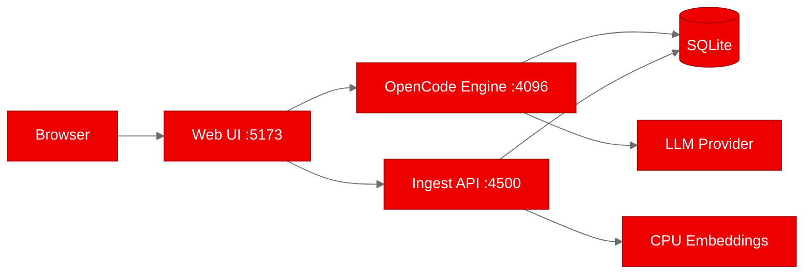

# Deploying a Self-Hosted Legal AI Platform on OpenShift: A doc.haus PoC

Legal teams need AI that stays on their infrastructure. We deployed doc.haus, an open-source multi-agent legal AI platform, on Red Hat OpenShift to prove it works in an enterprise Kubernetes environment.

## What is doc.haus?

doc.haus is an open-source, self-hosted platform that brings multi-agent AI to legal document workflows. Built as a fork of [OpenCode](https://github.com/anomalyco/opencode), it retargets the agent harness from code onto legal documents. The result: a platform where legal professionals can upload contracts, ask questions in plain English, and get answers with exact clause citations, all without their documents leaving their infrastructure.

The platform supports Word-native tracked changes (real redlines, not diffs), multi-agent review workflows where multiple AI agents analyze contracts from different perspectives, and a template library for drafting new documents. It connects to over 75 model providers, including fully local options like Ollama and vLLM.

## Why it matters for enterprise legal AI

The legal industry has a data sovereignty problem. Client documents are privileged, and firms can't send them to third-party cloud services without careful consideration. doc.haus addresses this by running entirely on infrastructure you control.

For platform engineers, the interesting question is whether this kind of multi-process, agent-driven application can run smoothly on OpenShift. doc.haus has three co-located processes (an OpenCode engine, a Hono-based document ingest API, and a React/Vite web frontend) that share a workspace directory. It uses SQLite for storage and CPU-based embeddings via Hugging Face Transformers. No GPU required.



## Containerizing for OpenShift

doc.haus ships with a Dockerfile based on the Bun runtime image. For OpenShift, we needed a UBI9-based image. Since Red Hat doesn't publish a Bun-specific UBI image, we started with `registry.access.redhat.com/ubi9/nodejs-22` and installed Bun via npm:

```dockerfile
FROM registry.access.redhat.com/ubi9/nodejs-22

USER 0
RUN dnf install -y python3 python3-pip gcc gcc-c++ make lsof procps-ng poppler-utils \
  && dnf clean all \
  && pip3 install --no-cache-dir "markitdown[pdf]"

RUN npm install -g bun@1.3.14
```

The native node-gyp modules (tree-sitter for code parsing) needed gcc and make. Poppler-utils handles PDF conversion. We originally included tesseract for OCR, but the package isn't available in UBI9 repos, so we dropped it as non-essential for the PoC.

The dependency installation mirrors the upstream `start.sh` pattern: four separate `bun install` commands for the root workspace, the dochaus config layer, the ingest service, and the web app. Each has its own lockfile.

```dockerfile
RUN for dir in . dochaus services/ingest apps/web; do \
      (cd "$dir" && bun install --frozen-lockfile); \
    done

RUN chgrp -R 0 /opt/app-root /data/workspace && \
    chmod -R g=u /opt/app-root /data/workspace

USER 1001
CMD ["./start.sh"]
```

The `chgrp -R 0` and `chmod -R g=u` commands are critical for OpenShift, where containers run with an arbitrary UID in group 0.

## Deploying to the cluster

We used OpenShift's binary build strategy to build the image on-cluster and push it to Quay.io:

```bash
oc new-build --name=doc-haus-dochaus --binary --strategy=docker \
  --to-docker --to="quay.io/aicatalyst/doc-haus:latest" \
  --push-secret=autopoc-registry-push -n autopoc-test-builds

oc start-build doc-haus-dochaus --from-dir=. --follow --wait -n autopoc-test-builds
```

The Kubernetes deployment exposes all three ports through a single Service:

```yaml
ports:
  - port: 5173   # Web UI
    name: web
  - port: 4096   # OpenCode engine
    name: engine
  - port: 4500   # Ingest API
    name: ingest
```

A 1Gi PersistentVolumeClaim stores matters, documents, and the search index. The three processes communicate through localhost within the pod, just as they do in a local development setup.

One thing we hit: the Quay.io repository was initially private, causing `ImagePullBackOff`. Adding a pull secret to the deployment namespace and linking it to the default service account resolved it.

## What the tests showed

All three services passed their health checks:

| Service | Port | Test | Result | Response Time |
|---------|------|------|--------|---------------|
| Web UI | 5173 | GET / | PASS | 0.01s |
| Ingest API | 4500 | GET /matters | PASS | < 0.01s |
| OpenCode Engine | 4096 | GET / | PASS | 15.04s |

The web UI returned the React app shell immediately. The ingest service responded with an empty matters array (no documents uploaded yet). The engine returned its HTML shell, though the response took 15 seconds due to connection handling.

One notable finding: Vite's development server blocks requests from non-localhost hostnames by default, returning a 403 for the cluster's DNS name. In production, you'd either build the frontend for static serving or configure `server.allowedHosts`. For testing, we used direct pod IP access with a `Host: localhost` header.

## What we learned

**Bun on UBI works**. Installing Bun via npm on a Node.js UBI image is straightforward and the Bun runtime operates normally. This pattern works for any Bun-based project targeting OpenShift.

**Multi-process containers are viable** for PoC-scale deployments. The three processes co-locate well in a single pod, sharing a workspace directory through a PVC. For production, splitting into separate deployments with a shared database would enable independent scaling.

**No GPU needed**. doc.haus uses `@huggingface/transformers` for CPU-based embeddings. The embedding model downloads on first use and runs entirely on CPU. This makes deployment accessible on standard worker nodes.

**LLM provider configuration is runtime, not build-time**. The platform boots without any API keys and lets users configure their provider through the Settings UI. For automated deployments, credentials can be injected via Kubernetes Secrets.

## Try it yourself

The deployment artifacts are available at:
- [Fork repository](https://github.com/aicatalyst-team/doc-haus) with Dockerfile.ubi and Kubernetes manifests
- [PoC report](https://github.com/aicatalyst-team/doc-haus/blob/autopoc-artifacts/poc-report.md) with full pipeline details

To deploy doc.haus on your own OpenShift cluster:

1. Clone the fork and build the UBI image using the provided `Dockerfile.ubi`
2. Push to your container registry
3. Apply the Kubernetes manifests from the `kubernetes/` directory
4. Open the web UI and configure your preferred LLM provider in Settings

doc.haus is MIT licensed and actively maintained. For enterprise implementations, reach out to [SureScale.ai](https://surescale.ai).
