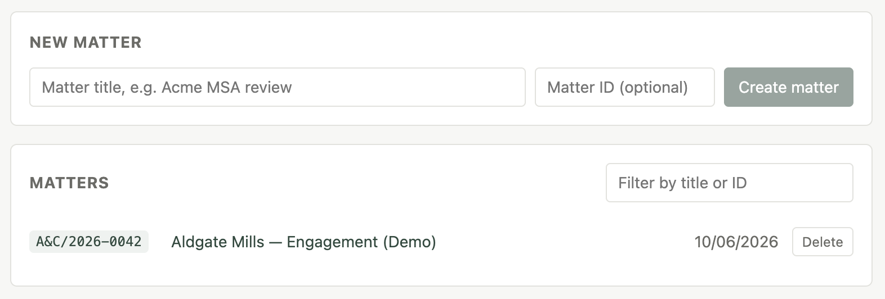
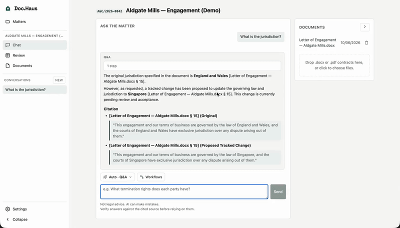

<h1 align="center">doc.haus</h1>

<p align="center">The open-source legal AI agent. Your documents stay on your machine; the redlines land in Word.</p>

<p align="center">
  <a href="LICENSE"></a>
  <a href="https://github.com/anomalyco/opencode"></a>
  
  
</p>

<!-- TODO: drop asset — hero video/GIF: conversation with a question + redline, automatic agent selection
<p align="center">
  
</p>
-->

---

- **Documents never leave your infrastructure.** Each matter gets its own local index on
  your own disk; there is no doc.haus cloud, and the AI model itself can run locally too.
- **Word-native.** Real tracked changes baked into the `.docx` itself — open the result
  in Word and accept or reject each change, exactly as if a colleague had marked it up.
- **Every answer cites the clause it came from**, quoted verbatim, so you can verify it
  before you rely on it.

## Get started

You need [Bun](https://bun.sh) (`curl -fsSL https://bun.sh/install | bash`). Then:

```bash
git clone https://github.com/sure-scale/doc-haus.git && cd doc-haus
bun install
./start.sh --demo
```

The browser opens with a demo matter ready: a fictional letter of engagement, already
ingested. On first run the app asks you to connect a model provider in **Settings** —
an API key (Anthropic, OpenAI, …), a Google Cloud sign-in, or a fully local endpoint
(Ollama, vLLM, LM Studio). See [docs/providers.md](docs/providers.md) for copy-paste
configs.

Try asking: *What is the cap on the firm's liability?* — you get the answer cited to
the exact clause, quoted from the document. More things to try in
[demo/README.md](demo/README.md).

To work on your own documents: create a matter, upload a `.docx`, and ask. Everything —
conversations, documents, the index — persists on your machine.

## What you can do

### Every engagement gets its own private workspace

Matters are separate, self-contained workspaces. Each one holds its documents,
conversations, and a private search index — nothing is shared between them.

<!-- TODO: drop asset — matter listing screenshot
<p align="center">
  
</p>
-->

### Ask in plain English; it answers with citations or redlines the document

One conversation handles both. Ask a question and the right agent answers it with the
clause cited and quoted. Ask for a change and the redlining agent writes it as tracked
changes into the `.docx` itself — doc.haus picks the right agent for each request
automatically.

<!-- TODO: drop asset — conversation video/GIF (question + redline, auto agent selection)
<p align="center">
  
</p>
-->

### Review every contract in the matter as a grid

Define question-columns once — *Liability cap*, *Payment terms*, *Governing law* — and
doc.haus answers them for every document in the matter, side by side, instead of one
conversation at a time.

<!-- TODO: drop asset — tabbed review video/GIF
<p align="center">
  
</p>
-->

## Why firms can trust it

doc.haus is **self-hosted on infrastructure you control** — no doc.haus cloud, no
multi-tenant service, no vendor holding your clients' privileged documents. Document
text and embeddings never leave your disk; the only thing that touches the network is
the prompt sent to the model provider you chose, and that provider can be a local model
so it need not leave either. Everything binds to localhost by default; to put it in
front of a team, front it with the reverse proxy and SSO your firm already trusts. MIT
licensed — embed it, modify it, ship it. Full posture and vulnerability reporting in
[SECURITY.md](SECURITY.md).

## Built on OpenCode

doc.haus is a true fork of [OpenCode](https://github.com/anomalyco/opencode) that
retargets its agent harness from code onto legal documents — so it inherits a real,
battle-tested agent engine (multi-agent review, permissions, skills, 75+ model
providers) and keeps pulling upstream improvements via merge. The concepts map 1:1:

| Legal concept        | OpenCode primitive             |
| -------------------- | ------------------------------ |
| Matter               | project (a directory)          |
| Document             | a file in the matter dir       |
| Conversation         | session                        |
| Legal agent          | agent                          |
| Multi-agent review   | primary agent + Task subagents |
| Retrieval / citation | a custom tool                  |

Built by [Sure Scale](https://github.com/sure-scale) on OpenCode by the Anomaly team,
MIT licensed. doc.haus is not affiliated with or endorsed by the OpenCode team.

## Disclaimer

doc.haus is software, not a law firm. Its output is **not legal advice** and, like all
AI output, it can be wrong. Every answer cites its source so it can be checked — check
it, and review anything doc.haus produces with a licensed attorney before relying on it.

## Learn more

- [docs/architecture.md](docs/architecture.md) — how it works: the three processes, the
  agents and tools, models and providers, running pieces by hand, mergeability.
- [docs/providers.md](docs/providers.md) — connect Anthropic, OpenAI, Google Vertex, or
  a fully local model.
- [demo/README.md](demo/README.md) — the demo matter and what to try.
- [CONTRIBUTING.md](CONTRIBUTING.md) · [SECURITY.md](SECURITY.md) · [FUTURE.md](FUTURE.md)
