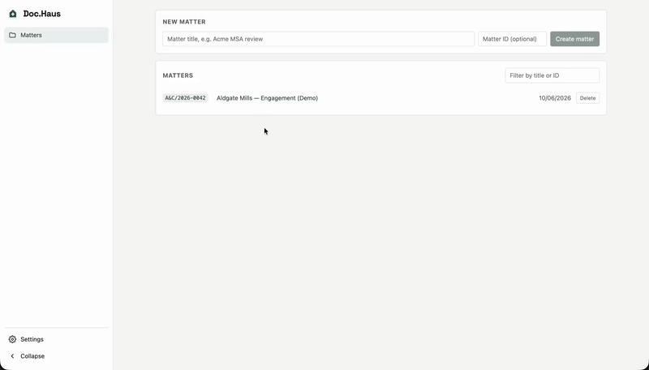

> [!WARNING]
> **This repository is archived.**
>
> Archived on 2026-09-08 by the AI Catalyst Platform Team.
> It is read-only and no longer maintained.

---<h1 align="center">doc.haus</h1>

<p align="center"><strong>Not a chatbot. A legal team that works on your machine.</strong><br />Open-source multi-agent legal AI — your documents stay on your machine; the redlines land in Word.</p>

<p align="center"><a href="https://doc.haus"><strong>doc.haus</strong></a> — the website, with video demos of everything below.</p>

<p align="center">
  <a href="LICENSE"></a>
  <a href="https://github.com/anomalyco/opencode"></a>
  
  
  
</p>

<p align="center">
  
</p>

---

- **Documents never leave your infrastructure.** Each matter gets its own local index on
  your own disk; there is no doc.haus cloud, and the LLM models the agents run on can be
  local too.
- **Word-native.** Real tracked changes baked into the `.docx` itself — open the result
  in Word and accept or reject each change, exactly as if a colleague had marked it up.
- **Every answer cites the clause it came from**, quoted verbatim, so you can verify it
  before you rely on it.

## Get started

You need [Bun](https://bun.sh) (`curl -fsSL https://bun.sh/install | bash`). Then:

```bash
git clone https://github.com/sure-scale/doc-haus.git && cd doc-haus
./start.sh --demo
```

The browser opens with a demo matter ready: a fictional letter of engagement, already
ingested. On first run the app asks you to connect a model provider in **Settings** —
an API key (Anthropic, OpenAI, …), a Google Cloud sign-in, or a fully local endpoint
(Ollama, vLLM, LM Studio). See [docs/providers.md](docs/providers.md) for copy-paste
configs.

Try asking: *What is the cap on the firm's liability?* — you get the answer cited to
the exact clause, quoted from the document. More things to try in
[demo/README.md](demo/README.md).

To work on your own documents: create a matter, upload a `.docx` or `.pdf` (including
flat scans — OCR runs automatically when [Poppler](https://poppler.freedesktop.org) and
[Tesseract](https://github.com/tesseract-ocr/tesseract) are installed), and ask.
Everything — conversations, documents, the index — persists on your machine.

### Or with Docker

No Bun install needed — just Docker:

```bash
git clone https://github.com/sure-scale/doc-haus.git && cd doc-haus
docker compose up
```

Open <http://localhost:5173> and connect a provider in **Settings** on first run. Matters
persist in a `dochaus-workspace` volume. For the Google Vertex provider, uncomment the
gcloud mount in `docker-compose.yml`.

## What you can do

- **Every engagement gets its own private workspace.** Matters are separate,
  self-contained workspaces — each holds its documents, conversations, and a private
  search index, and nothing is shared between them.
- **Ask in plain English; get citations or redlines.** One conversation handles both:
  questions come back with the clause cited and quoted, and edit requests land as
  tracked changes in the `.docx` itself.
- **Draft new documents from a template or from scratch.** Ask for an NDA or any
  document and doc.haus drafts it into the matter — filling a firm template's
  placeholders or composing from scratch onto a styled blank — then writes and
  indexes the `.docx` so you can review and redline it right away, with anything it
  can't know left as bracketed placeholders.
- **Build a firm template library.** A dedicated Templates section holds the reusable
  drafting bases shared across every matter: upload a `.docx`, describe the template
  you need to the Template Builder and it composes one, or save a finished matter
  document as a template — with every client-specific detail scrubbed into
  `[insert ...]` placeholders before it enters the library.
- **Pick an assistant — or let Auto choose.** Switch between focused assistants —
  *Q&A*, *Redline*, *Research*, *Draft* — or leave it on *Auto* and doc.haus routes
  each message to the right agent as the conversation moves between asking, drafting,
  editing, and researching.
- **Run a full multi-agent review in one click.** Pick a workflow like *Full review*
  and a reviewer, an adversarial challenger, and a summarizer each read every
  document, then hand back one combined report — the multi-agent engine doc.haus
  inherits from OpenCode, pointed at contracts.
- **Review every contract in the matter as a grid.** Define question-columns once —
  *Liability cap*, *Payment terms*, *Governing law* — and doc.haus answers them for
  every document in the matter, side by side.

Video demos of each on [doc.haus](https://doc.haus).

## Why firms can trust it

doc.haus is **self-hosted on infrastructure you control** — no doc.haus cloud, no
multi-tenant service, no vendor holding your clients' privileged documents. Document
text and embeddings never leave your disk; the only thing that touches the network is
the prompts the agents send to the model providers you chose, and those can be local
models so nothing need leave at all. Everything binds to localhost by default; to put it in
front of a team, front it with the reverse proxy and SSO your firm already trusts. MIT
licensed — embed it, modify it, ship it. Full posture and vulnerability reporting in
[SECURITY.md](SECURITY.md).

## Built on OpenCode

doc.haus is a true fork of [OpenCode](https://github.com/anomalyco/opencode) that
retargets its agent harness from code onto legal documents — so it inherits a real,
battle-tested agent engine (multi-agent review, permissions, skills, 75+ model
providers) and keeps pulling upstream improvements via merge. The concepts map 1:1:

| Legal concept        | OpenCode primitive             |
| -------------------- | ------------------------------ |
| Matter               | project (a directory)          |
| Document             | a file in the matter dir       |
| Conversation         | session                        |
| Legal agent          | agent                          |
| Multi-agent review   | primary agent + Task subagents |
| Retrieval / citation | a custom tool                  |

Built by [Nick Watson](https://www.linkedin.com/in/nickpwatson/) from
[SureScale.ai](https://surescale.ai) on OpenCode by the Anomaly team, MIT licensed. The
heavy lifting — the agent engine itself — is theirs; doc.haus is the legal layer on top.
doc.haus is not affiliated with or endorsed by the OpenCode team.

Open to working with firms on implementations, customizations, and integrations — reach
out on [LinkedIn](https://www.linkedin.com/in/nickpwatson/).

## Credits

- [Docxodus](https://github.com/JSv4/Docxodus) — DOCX parsing and manipulation
- [OpenCode](https://github.com/anomalyco/opencode) — agent shell this is built on

## Disclaimer

doc.haus is software, not a law firm. Its output is **not legal advice** and, like all
AI output, it can be wrong. Every answer cites its source so it can be checked — check
it, and review anything doc.haus produces with a licensed attorney before relying on it.

## Learn more

- [doc.haus](https://doc.haus) — the website, with video demos.
- [docs/architecture.md](docs/architecture.md) — how it works: the three processes, the
  agents and tools, models and providers, running pieces by hand, mergeability.
- [docs/providers.md](docs/providers.md) — connect Anthropic, OpenAI, Google Vertex, or
  a fully local model.
- [demo/README.md](demo/README.md) — the demo matter and what to try.
- [CONTRIBUTING.md](CONTRIBUTING.md) · [SECURITY.md](SECURITY.md) · [FUTURE.md](FUTURE.md)