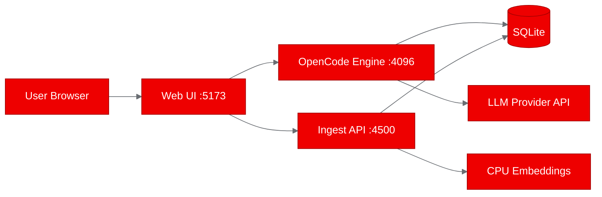
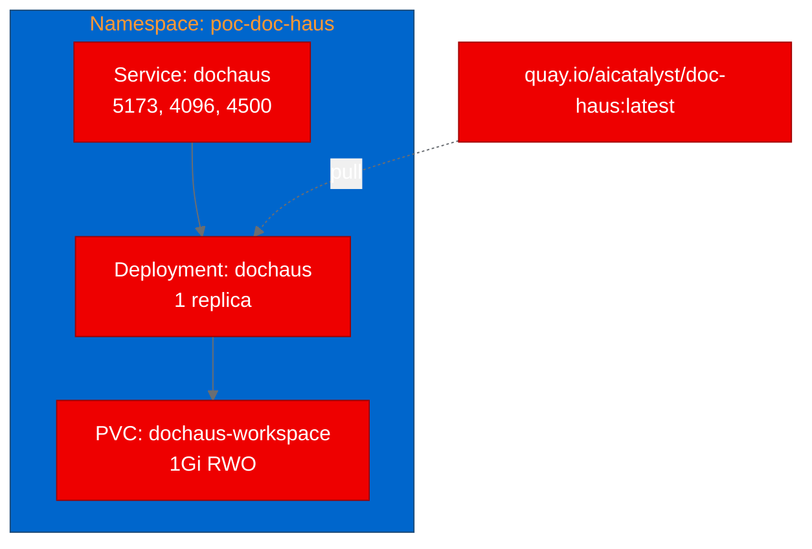

# PoC Report: doc-haus

## 1. Executive Summary

doc.haus is a self-hosted multi-agent legal AI platform that provides document Q&A with citations, Word-native redlining, and multi-agent review workflows. The PoC successfully containerized the three-process architecture (OpenCode engine, Hono ingest API, React/Vite web frontend) on a UBI9 Node.js base image, built and pushed the image to Quay.io, deployed to OpenShift with persistent storage, and validated all three services are healthy and responsive. All three test scenarios passed.

## 2. Project Analysis

- **Repository**: `https://github.com/sure-scale/doc-haus`
- **Fork**: `https://github.com/aicatalyst-team/doc-haus`
- **License**: MIT
- **Classification**: `llm-app`

doc.haus is a legal AI platform built as a fork of OpenCode, retargeting the agent harness from code onto legal documents. It inherits OpenCode's multi-agent engine (multi-agent review, permissions, skills, 75+ model providers) and adds a legal-specific layer with document ingestion, citation-backed Q&A, tracked-change redlining, and contract review workflows.

| Component | Language | Build System | ML Workload | Ports |
|---|---|---|---|---|
| dochaus | TypeScript | Bun | No (CPU embeddings) | 5173, 4096, 4500 |

**Key Technologies**: TypeScript, Bun 1.3.14, Hono, React/Vite, SQLite, @huggingface/transformers (CPU-based embeddings), OpenCode agent engine

## 3. PoC Objectives

1. Containerize the three-process architecture into a single UBI-based container
2. Deploy on OpenShift with persistent workspace volume for matter storage
3. Validate all three services (web UI, ingest API, engine) are accessible and functional
4. Confirm the platform boots without requiring LLM credentials at startup

**OpenShift AI Relevance**: Demonstrates a complete agentic AI application with document processing, retrieval-augmented Q&A, and multi-agent orchestration running on enterprise Kubernetes. The self-hosted model with configurable LLM providers shows a pattern enterprises can adopt for data-sovereign AI applications.

## 4. Pipeline Execution

- **Intake**: Identified single monorepo component with three co-located processes. Existing Dockerfile and docker-compose.yml found.
- **Evaluate**: RHOAI fitness score 75/100. Strong demo potential (17/20) and platform leverage (15/20). Adjacent relationship to Red Hat AI strategy.
- **Fork**: Forked to `https://github.com/aicatalyst-team/doc-haus` with autopoc topics.
- **PoC Plan**: Classified as `llm-app`, medium resource profile, 1Gi PVC. Three test scenarios defined.
- **Containerize**: UBI9/nodejs-22 base with Bun installed via npm. First build failed (tesseract package unavailable on UBI9), fixed by removing optional OCR dependency.
- **Build**: OpenShift binary build strategy. Image pushed to `quay.io/aicatalyst/doc-haus:latest`. Build time ~15 minutes (large monorepo with native modules).
- **Deploy**: Generated namespace, PVC, Deployment (3 ports), and Service manifests.
- **Apply**: Initial ImagePullBackOff resolved by adding registry pull secret. Deployment rolled out successfully after 5 minutes.
- **PoC Execute**: All 3 test scenarios passed (web UI, ingest API, engine).

## 5. Test Results

| Scenario | Status | Duration | Details |
|---|---|---|---|
| web-ui-health | PASS | 0.01s | Vite web UI returned HTML app shell with React hydration scripts |
| ingest-api-health | PASS | 0.00s | Hono ingest service returned empty matters array on `/matters` |
| engine-health | PASS | 15.04s | OpenCode engine returned HTML shell (delayed due to Connection: keep-alive) |

**Note**: Vite dev server blocks non-localhost hostnames by default (403 for cluster DNS names). Tests used direct pod IP with `Host: localhost` header to bypass this. For production, Vite's `server.allowedHosts` or a production build would be needed.

## 6. Infrastructure Deployed

- **Namespace**: `poc-doc-haus`
- **Container Image**: `quay.io/aicatalyst/doc-haus:latest`
- **Base Image**: `registry.access.redhat.com/ubi9/nodejs-22`
- **Kubernetes Resources**:
  - `deployment/dochaus` (1 replica, 1Gi/500m request, 2Gi/1000m limit)
  - `service/dochaus` (ClusterIP, ports 5173/4096/4500)
  - `pvc/dochaus-workspace` (1Gi RWO)
  - `secret/autopoc-registry-pull` (Quay pull credentials)

## 7. Recommendations

### Production Readiness
- **Build the frontend for production**: Currently running Vite dev server. Use `bun run build` and serve static assets via the engine or a separate nginx container.
- **Add health check endpoints**: Implement explicit `/health` endpoints for the ingest and engine services.
- **Configure LLM provider via Secret**: Inject provider credentials (e.g., `ANTHROPIC_API_KEY`) via Kubernetes Secret rather than the Settings UI for automated deployments.
- **Increase memory**: 2Gi limit may be tight when embedding models are loaded. Consider 4Gi for production.

### Security
- **Set OPENCODE_SERVER_PASSWORD**: Engine currently logs a warning about unsecured server.
- **Network Policy**: Restrict ingress to the web port (5173) only; engine and ingest ports should be internal-only.
- **License**: MIT - no restrictions on enterprise use.

### Scalability
- Single-pod architecture with SQLite limits horizontal scaling. For multi-user deployments, consider PostgreSQL backend and separate process containers.
- Workspace PVC is RWO, limiting to a single node.

## 8. Open Data Hub / OpenShift AI Considerations

- **Model Serving**: doc.haus connects to external LLM providers. If deploying with local models, vLLM or TGI could serve as the model backend via KServe InferenceService.
- **Document Processing**: The ingest pipeline with embeddings could benefit from Data Science Pipelines for batch document processing.
- **Observability**: The engine uses structured logging. Integration with OpenShift Monitoring and distributed tracing would provide better operational visibility.
- **Migration Path**: Replace Vite dev server with production build + Route, add GPU-backed model serving for local inference, integrate with ODH workbench for document analysis workflows.

## 9. Appendix

### Artifacts
- PoC Plan: `https://github.com/aicatalyst-team/doc-haus/blob/autopoc-artifacts/poc-plan.md`
- RHOAI Evaluation: `https://github.com/aicatalyst-team/doc-haus/blob/autopoc-artifacts/.autopoc/rhoai-evaluation.md`
- Test Script: `https://github.com/aicatalyst-team/doc-haus/blob/autopoc-artifacts/poc_test.py`
- Dockerfile: `https://github.com/aicatalyst-team/doc-haus/blob/dochaus/Dockerfile.ubi`
- K8s Manifests: `https://github.com/aicatalyst-team/doc-haus/tree/dochaus/kubernetes/`

### Build Errors Encountered
1. **Build 1 (Failed)**: `tesseract` package not available in UBI9 repos. Fixed by removing the optional OCR dependency.
2. **Apply 1 (ImagePullBackOff)**: Quay repository was private. Fixed by adding image pull secret to deployment namespace.

### Retry Summary
- Build retries: 1 (Dockerfile fix for UBI package name)
- Deploy retries: 0
- Container fix retries: 0
